*I don't build websites. I build worlds.*

*Geometry. Light. Motion. The web as a medium for spatial experience.*

*Most frontends are flat. Mine aren't.*

---

### What I do

I work at the intersection of **creative development** and **engineering** —
where shaders meet components, and math becomes visual.

My focus is **3D web** — real-time rendering, interactive environments,
and the kind of interfaces that make people stop scrolling.

When I'm not thinking in three dimensions, I write backend logic in **Go**
and build Android apps in **Kotlin**.

---

### Stack

---

### Currently

- Sharpening **WebGL** and shader fundamentals
- Exploring the boundary between UI and spatial computing
- Building things that don't exist yet

---

### Contact

